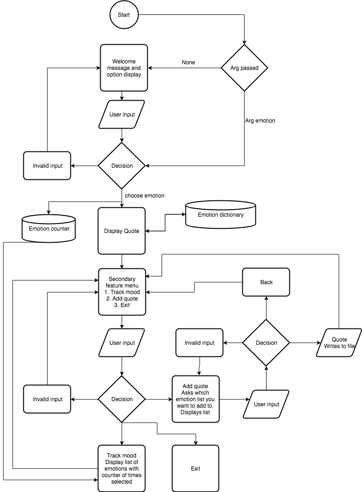
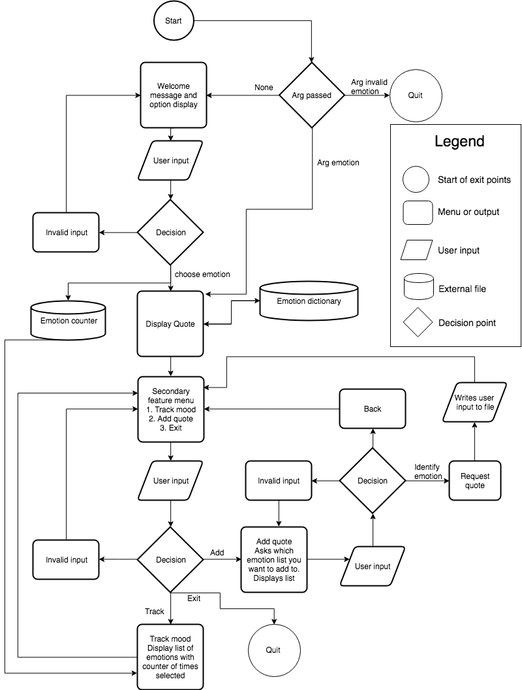
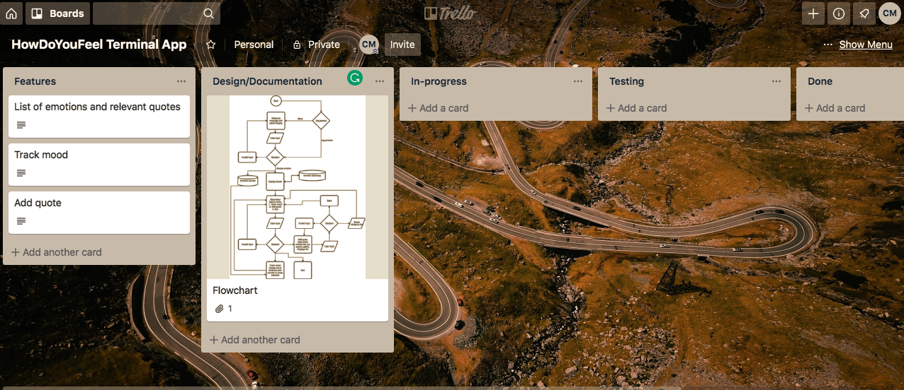
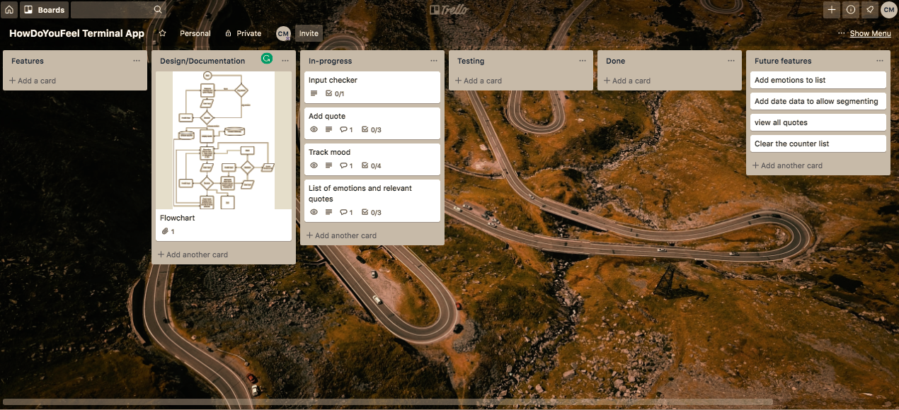

# Software development plan

## purpose

The purpose of the How Do You Feel application is to track your mood during the day. It also allows you to see your history of how you have been feeling and give you inspirational quotes that match your mood.

## Scope

#### high level

As a <ROLE> I want to <DO> so that <BENEFIT>

As a human, I want to better identify my emotions so I can be more aware of my emotions. 

#### Problem

How do you track your emotions as they shift during the day and reflect accurately on how you have felt over time. How can you accurately track how often you feel a certain way? Now you can. This app will be quick for the user to input how they are feeling during the course of the day in order to be able to accurately reflect on how they have felt at the end of the day. This will allow for better self reflection and personal growth, without having to leave the terminal or take up a lot of time. The quotes are also chosen to match the users mood and allow a moment of reflection.

#### Audience

The audience is anyone interested in better identifying and tracking their emotions. It is designed to be quick to input your mood and exit, in order to cater to a busy software developer who was interested in data-driven personal insights and personal growth.

#### How it will be used

When the application starts, a user is asked how they feel. When they identify their emotion from a list, they are presented with a quote that is randomly selected from a list of inspirational quotes relevant to that emotion. The emotion is written to an external file in order to be counted.

After reading the quote, the user goes to a secondary menu where they can either track their mood or add a quote. If they track their mood, a cumlative count of the mood inputs is displayed. 

If they add a quote, they select which list they want to append, then are prompted to input a quote that is appended to the relevant list.

# Features

### Printing a random quote that reflects the user's mood.
This function calls and prints a predetermined list of emotions for the user to choose from a separate text file. Once they have inputted how they are feeling, the user input is used to search a json file with a dictionary containing the emotions and relevant quotes. The emotion is the key value, linked to a list of quotes. A random choice picks one of the items from the list and prints it for the user. It uses try/except for error handling when looking for the txt file containing the list of emotions. It uses a while True loop for user input, checking the input against the list of available emotions.

### Track your mood with a cumulative counter.
This function takes the user input when they identify their mood and writes it to a separate text file. This allows another function to count the instances of the emotions in the file to show the user how many times they have felt any particular emotion. It uses try/except for error handling when looking for the txt file containing the list of emotions that the user has selected. It uses a for loop to run the count of word strings and a while True loop for user input, checking against pre-set values.

### Add a quote to the emotion dictionary - stored as a .json file.
This allows the user to add extra quotes to the dictionary. Firstly they identify the key value (emotion), then input their quote. This quote is appended to the list of the key value by loading the json file then appending the user inputted quote to to selected key, then dumping the list back to the json file. It uses try/except for error handling when looking for the json file containing the dictionary of quotes and the text file with the list of emotions. It also uses a while True loop for user input, checking the user input against the list of emotions.

# User Interaction
## Outline

The user starts the application, either passing an argument that is their current mood or leaving it blank. If a valid argument is passed, a relevant quote is printed on the screen. If no argument is passed, a menu is displayed asking for input and displaying the available moods. Once a valid mood has been inputted, a quote is printed on the screen that is randomly selected from the emotion dictionary that corresponds to the inputted mood. If an invalid input is passed as an argument, the application uses if/elif/else to direct the user to the help funtion and exits the app. This is so they can fix a spelling error quickly, and pass a correct argument, rather than go through the main menu. 

The user then sees a second menu, where they can either track their mood and see what they have selected previously, or add a quote, in which they identify the mood and input the quote to be written to the dictionary. Each of these features uses a try/except loop to catch if the relevant file they are referring to are present. If the file is not present, it will tell the user that they are missing a file and exit the app. Input errors are handled with a while True loop, checking user input against lists, and printing error messages and prompting the user to redo the input.

After that, the user exits the app.

# Control flow diagram

This is the initial control flow

This is the updated control flow that includes a legend for readsability.

# Implementation plan

This is the initial Trello board

This is the board at the end of writing the code, prior to writing the tests.

# Status updates

27/6

- The idea behind the app is wanting a data series that will be able to be presented using hte python package matplotlib. A quick emotion tracking app that is able to be run throughout the day as your mood changes will provide good data pieces that will be of benefit to the user. It will also allow for future iterations to explore timed notifications, data set segmentation along dates and time, and scraping for other quotes to expand the emotion dictionary. Thinking about the flow of the application, I am trying to make it both fit within the scope of my coding ability but also contain the necessary technical components necessary. My thought here is that it is better to start simple and add features than the other way around.

29/6

- The code for the app has been written and is functional. The addition of the argparse allows a user to skip the first menu and streamline the first half of the app. Future features will look at expanding the potential arguments that can be parsed to extend into the second menu. At this stage, I have been committing to git and running the code through pylint to clean up the syntax. The remaining part is creating tests for the various functions. Additionally, I have moved the integration of matplotlib to a future feature to better visualise the counter data.

4/7

- Writing the tests today, added integrating emojis into future feature updates on Trello to improve UX.

# Help
## How to install
## Dependencies

json
random
argparse

## System requirements

# Testing procedure
